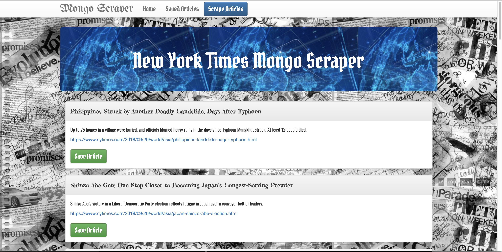

# New York Times Article Scraper

## Overview
Whenever a user visits this site, the app should scrape news from a NewYorkTimes website and display them for the user. Each scraped article saves to your application database. The limit for scraped articles was set to 20 for better testing and easy use.

## Link for heroku website 
https://fierce-plains-80035.herokuapp.com/

## Screenshots

## Functionality

* User can scrape new articles by clicking "Scrape Articles" button.
* User can save the articles by clicking "Save Article" button under each scraped article. Save articles will appeir under the "Saved Articles" section.
* User can see list of the saved articles by clicking "Saved articles" nav item.
* User can add a note for the saved article by clicking "Add a Note" button under the saved article panel inside the Note module.
* User can delete existing note for the saved article by clicking "X" button inside the Note module.
* User can delete saved article by clicking "Delete" button under the saved article panel.
* User can return to the list of scraped articles by clicking "Mongo Scraper" or "Home" nav items.

## Technologies Used
* Node.js
* Express.js
* MongoDB
* Mongoose
* Handlebars.js
* Body-parser
* Cheerio
* Request

